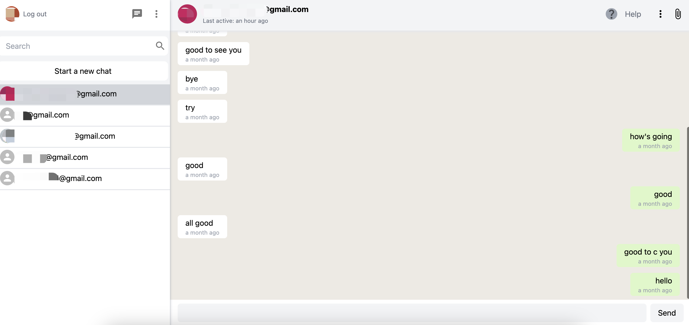

## Introduction

WhatsApp Clone is a messaging app that allows you to chat with your friends and family in real-time, just like WhatsApp.

## Screenshot



## Try it online

```
https://whatsapp-clone-six-psi.vercel.app/
```

## Download and Installation

To install WhatsApp Clone, follow these steps:

1. Clone this repository
2. Install dependencies using `npm install`
3. Configure Firebase by following the instructions in the Firebase documentation
4. Start the app using `npm start`

## Functions

* Log in via Google (Oauth) and log out
* Add friends via their Gmail and start chatting
* See the time that your friend last active

## Contributing
We welcome contributions from the community.